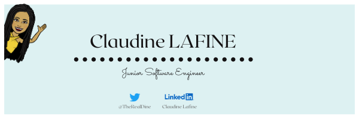
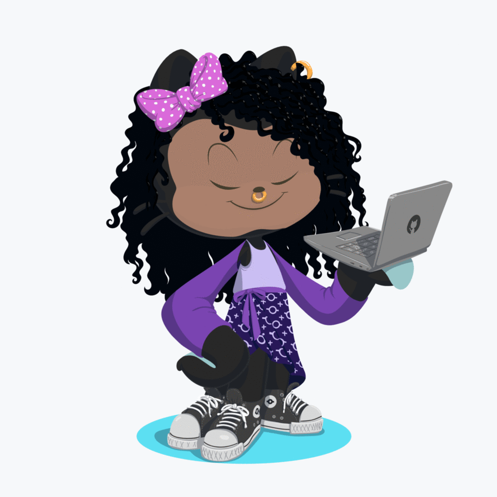

# Hi, I'm Claudine, welcome!

Although, I often describe myself as a front-end developer, I'm interested by both front-end and back-end.
In fact, to be perfectly honest I want to understand how things work and that's why my interests go beyond just programming, I like to keep myself informed on Software development security, Web Accessibility, App containerization, Continuous Integration, DevOps, Agile software development...

Lately, I've been digging into GraphQL and its ecosystem, had a first dip into token-based authentication with or without JWT, been reading a lot about UX and UI design...
Sometimes I swear, there isn't enough hours in a day.

Follow and/or support my learning by visiting [my Gitlab](https://https://gitlab.com/Giannah)
